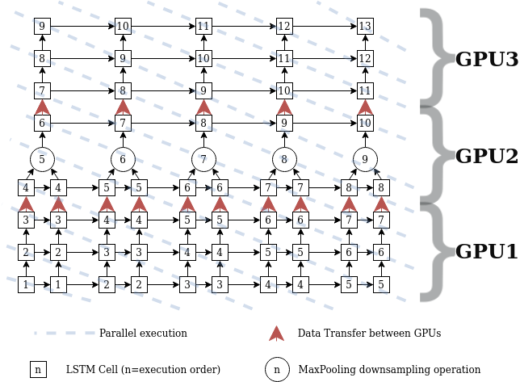

# 4LSTM-MaxPool-4LSTM Benchmark
In this benchmark we explore optimizing the block consisting of 4 LSTM layers forllowed by a pooling done on the sequence, followed by 4 other LSTM layers. We propose a version on mutli GPU, and compare it to a single GPU version implemented using Nvidia's cuDNN library.

The following figure shows the 4LSTM-MaxPool-4LSTM block, and our optimization approach based on :

1. Tranforming loops to discover fusable operators.
2. Fusing the 4LSTM, MaxPool and 4LSTM parts.
3. Applying Loop Skewing and parallelization on the outer loops.

`Note that this approach didn't yield good results and is almost 4x slower than the cuDNN version.`



## Folder Structure
The folder contains these files :
 1. `configuration.h` : which contains constants to be set for the block.
 2. `cudnn_functions.cu` : contains functions used to construct the architecture using cuDNN.
 3. `cuda_wrappers.cpp` : contains wrappers for cuda functions.
 4. `multi_gpu_deepspeech_kernels.cu` : contains the Multi GPU version kernels.
 5. `deepspeech_wrapper_comparison.cu` : contains the MultiGPU version as well as a call to the cuDNN version + comparison of execution times and output results.

## How to Run
 Ton compile the code you need to use 3 GPUs, for that.
### Set the Environment
Set the `CUDA_VISIBLE_DEVICES` environment variable to 0,1,2 (for using GPU devices 0, 1 and 2), this allows the code to have access to the GPUs of your choice, you can execute `nvidia-smi` to check what devices are free.
```
export CUDA_VISIBLE_DEVICES=0,1,2
```
### Compile and Run the Code
For that, run :
```
nvcc -std=c++11 deepspeech_wrapper_comparison.cu -lcublas -lcudnn -Xcompiler -fopenmp
```
This will compile the code and generate the `a.out` executable file.

Run the code :
```
./a.out
```
This will execute both the Multi GPU and the cuDNN versions and give their execution times. Note that you can tune the `GEMM_BATCH` parameter in the `configuration.h` file to get the best execution time for Multi GPU, `GEMM_BATCH` has to be a multiple of `SEQ_LENGTH/2`

If `CHECK_ERROR_DIFFERENCE` is set to 1 in the `configuration.h` file, a comparison of the outputs (cuDNN's and MultiGPU's) will be made. In this case, it's possible to see how in the first sequences we have a small difference in the output values, these differences get bigger as we go forward in the sequences, this is caused by numerical instability due to floating point calculations.
